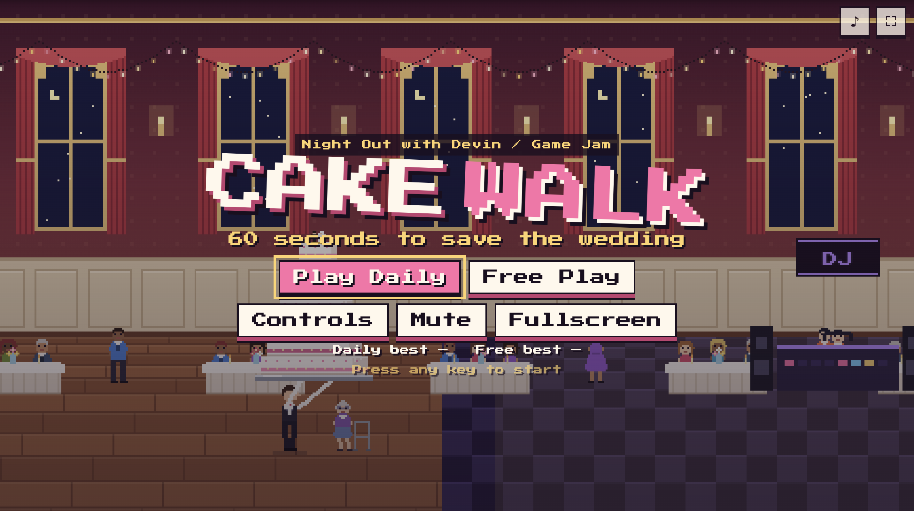
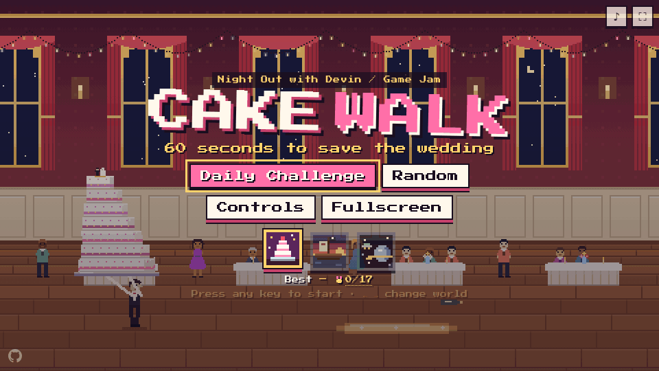

# 🎂 CAKE WALK

> **60 seconds to save the wedding.** Hold to walk. Move to balance.

<p align="center"></p>

```text
     ___________
    '._==_==_=_.'     .------------------------------------.
    .-\:      /-.     |                                    |
   | (|:. 1st |) |    |          * W I N N E R *           |
    '-|:.     |-'     |                                    |
      \::.    /       |          TINKERHUB  KOCHI          |
       '::. .'        |      DEVIN EVENT - 1ST PRIZE       |
         ) (          |                                    |
       _.' '._        |  7 TIERS . 60 SECONDS . 0 DROPPED  |
      '-------'       '------------------------------------'
```

<p align="center"><b>🏆 1st prize winner at the <a href="http://luma.com/fivtwyix">TinkerHub x Devin event in Kochi</a> 🏆</b><br/>
<i>Seven tiers, sixty seconds, and not a single cake dropped.</i></p>

You are a nervous waiter carrying a 7-tier wedding cake from the kitchen to the cake table
across a chaotic reception. The best man's toast happens at 0:00. If the cake isn't on the table
by then, or if it falls, the wedding is ruined.

Made for the **"60 Seconds to Save It"** game jam (Night Out with Devin): one minute, one level,
two inputs, a clear win or loss, and a cake that almost falls a lot but rarely actually does.



<!-- Record a GIF of a run (e.g. with ?bot=1) and save it as docs/gameplay.gif -->

**Play:** see the live Vercel URL in the repository description.

## Controls

Both inputs act on the same horizontal axis: speeding up tips the cake **back**, stopping tips it
**forward**. Slide the tray under the lean.

|             | Desktop                                               | Mobile                                                                |
| ----------- | ----------------------------------------------------- | --------------------------------------------------------------------- |
| **Walk**    | Hold `Space` / `W` / `↑` or the left mouse button     | Touch and hold the right half of the screen                           |
| **Balance** | Move the mouse left/right, or `A`/`D` / `←`/`→`       | Tilt the phone (tap _Enable tilt controls_), or drag on the left half |
| Retry       | `R`                                                   | _Retry_ button                                                        |
| Pause       | `P` / `Esc` (also automatic when the tab loses focus) | ❚❚ button                                                             |
| Mute        | `M`                                                   | ♪ button                                                              |
| Fullscreen  | `F`                                                   | ⛶ button                                                              |

Stop inside the glowing zone in front of the cake table, slow and upright, and hold still for
half a second to set the cake down.

## The level

1. **Kitchen doors** - calm tutorial zone with floating hints.
2. **Champagne spill** - slippery floor: stopping takes ~3x longer and you get random slips.
3. **Dancing Uncle** - hip-bumps into your path on a (seeded) rhythm. Wait for the gap or power through.
4. **Roomba** - patrols an ellipse; running into it makes you hop.
5. **Toddler Dash** - once you cross the trigger a toddler sprints across, aiming at you. Stop in time!
6. **Grandma with a walker** - blocks the lane for a few seconds. Patience, dear.
7. **Bass Drop** - at 20 s remaining the DJ counts 3-2-1 and drops the bass (wherever you are).
8. **Bouquet Toss** - the bouquet lands on the top tier, raising the centre of mass.
9. **Conga Line** - dancers cross the lane in sequence; each one that overlaps bumps you.
10. **Cake Table** - stop, hold still, deliver.

Every obstacle telegraphs itself about a second ahead with a `!` bubble or animation.

### Modes and seeds

- **Play Daily** - everyone gets the same variation for today's date (`YYYY-MM-DD`).
- **Free Play** - a random seed every round.
- `?seed=anything` forces a seed (great for replaying a friend's run).

The layout is fixed; the seed varies the uncle's rhythm, the Roomba's route, the toddler's
delay, grandma's patience, the bass-drop direction, the bouquet's landing offset and the conga
timing.

### Winning, losing, scoring

- **Win:** cake set down before 0:00 with at least 4 tiers.
- **Lose:** the tower topples (_"The cake has left the building."_), fewer than 4 tiers remain
  (_"That's not a wedding cake. That's a cupcake."_), or time runs out (_"The best man toasted
  an empty table."_).
- **Score** = tiers × 1000 + ⌊seconds left × 100⌋ + 250 per **CLUTCH** save (recovering from a
  lean past 30° without toppling).
- **Grades:** S = 7 tiers and ≥ 15 s left, A = 6+, B = 5, C = 4, F = loss. Best score and grade
  are stored per mode in `localStorage`.
- **Share** uses the Web Share API (with a PNG of the final frame when supported), otherwise it
  copies e.g. `🎂 CAKE WALK — Daily 2026-09-30 — Grade S — 7/7 tiers — 17.3s left — 3 clutch saves`.

## Running locally

Requires Node 20+.

```bash
npm install
npm run dev        # http://localhost:5173
```

| Script              | What it does                                                                              |
| ------------------- | ----------------------------------------------------------------------------------------- |
| `npm run dev`       | Vite dev server                                                                           |
| `npm run build`     | Type-check and build to `dist/`                                                           |
| `npm run preview`   | Serve the production build                                                                |
| `npm test`          | Vitest unit tests + the 30-seed headless bot run                                          |
| `npm run lint`      | ESLint + Prettier check                                                                   |
| `npm run typecheck` | `tsc --noEmit` (strict)                                                                   |
| `npm run e2e`       | Playwright smoke test against the built site (run `npx playwright install chromium` once) |

### Debug tools

- `?debug=1` - overlay with FPS, θ, ω, L, aTray, per-tier slides, hitboxes, block line and the
  seed. Keys `1`-`9`, `0` skip to each zone.
- `?bot=1` - the autopilot plays the real round (handy for demos and recording GIFs).
- Every gameplay constant lives in [`src/game/tuning.ts`](src/game/tuning.ts), commented.

## How it works

- **Vite + strict TypeScript + Canvas 2D.** No engine, no framework, no runtime dependencies.
  The whole game is ~30 KB gzipped.
- **Fixed 120 Hz simulation** with an accumulator; rendering every animation frame; frame dt
  clamped to 100 ms. 480×270 back buffer, integer-scaled when it fills the screen, letterboxed,
  `imageSmoothingEnabled = false`, devicePixelRatio aware.
- **Physics** (`src/physics/`, pure and unit-tested): the cake is an inverted pendulum on the
  tray, `θ'' = (G/L)·sinθ − (aTray/L)·cosθ − DAMP·ω − GLUE·θ + impulses`, with `L` recomputed
  from the tiers still standing (so losing tiers makes the cake twitchier). Each tier slides on
  the one below with a damped spring; past 45 % of the lower tier's width it falls off along with
  everything above it.
- **Input** (`src/input/`) reduces keyboard, mouse, touch and gyro into one
  `Intent { walk, trayTarget }` per tick - the simulation never sees raw input.
- **World** (`src/game/World.ts`) is completely headless, so the **autopilot**
  (`src/bot/autopilot.ts`, a PD controller on the lean plus predictive hazard gating) can play it
  in tests and in the title-screen attract mode.
- **Art** is procedural pixel art: string-array pixel maps plus palettes rendered to offscreen
  canvases at load. The cake is drawn upright offscreen and rotated with nearest-neighbour
  sampling for a crunchy pixel look.
- **Audio** is synthesized with the Web Audio API (no files): footsteps, a creak that tracks the
  lean, thumps, splats, crowd gasps, the bass drop, a fanfare, a sad trombone and a chiptune
  "Here Comes the Bride" loop that speeds up in the final 10 seconds.

### Tuning notes

The feel was tuned with headless parameter sweeps against controllers with simulated human
reaction delays:

| Constant                | Value       | Why                                                                                 |
| ----------------------- | ----------- | ----------------------------------------------------------------------------------- |
| `G / L_SCALE`           | 135 / 2.4   | Full cake L ≈ 61 px, G/L ≈ 2.2: an unbalanced full-throttle start topples in ~2.3 s |
| `DAMP`                  | 1.0         | Low on purpose - high damping makes slow tray corrections useless                   |
| `GLUE / GLUE_ZONE`      | 9 / 8.5°    | Frosting "catch net": small wobbles self-correct, big ones don't                    |
| `ARM_COUPLING`          | 0.5         | Half the walking jolt reaches the tray                                              |
| `TRAY_SPEED / RESPONSE` | 60 px/s / 7 | Smooth tray = forgiving of late, jerky corrections                                  |
| `SLIDE_GAIN`            | 4.1         | Top tier slides off after a sustained ~22° lean                                     |
| `TOPPLE_ANGLE`          | 40°         | Whole cake falls                                                                    |

A naive "hold walk and ignore the tray" run always topples; a tray controller with a 0.3 s
reaction delay still wins. The perfect bot wins all 30 test seeds with 7 tiers in 35.5-37.8 s
(22+ s to spare).

## Tests

- **Unit (Vitest):** pendulum stability at rest, toppling past the limit, tiers above a fallen
  tier are removed with it, seeded RNG determinism, outcomes (win/topple/cupcake/timeout),
  scoring and grade boundaries, share-text formatting, best-score storage, timer formatting.
- **Bot:** the autopilot runs the full simulation headlessly on 30 seeds and must win each with
  ≥ 5 tiers in under 55 s. If it can't, re-tune the level, not the bot.
- **Smoke (Playwright):** loads the built site, starts a game, holds walk for 3 s, and asserts no
  console errors and a decreasing timer.
- **CI:** GitHub Actions runs install, lint, typecheck, test and build on every push and PR.

## Deploying to Vercel

The repo deploys with zero configuration beyond importing it. `vercel.json` pins the Vite preset,
`npm ci`, `npm run build`, output `dist`, SPA-safe rewrites and immutable long-cache headers for
`/assets/*`.

1. Go to <https://vercel.com/new> and import the `cake-walk` GitHub repository.
2. Vercel detects **Vite**; leave the defaults (build `npm run build`, output `dist`).
3. Click **Deploy**. Every push to `main` then deploys to production, and PRs get previews.

Or from the CLI:

```bash
npx vercel@latest        # first run links the project
npx vercel@latest --prod
```

## License

[MIT](LICENSE)
